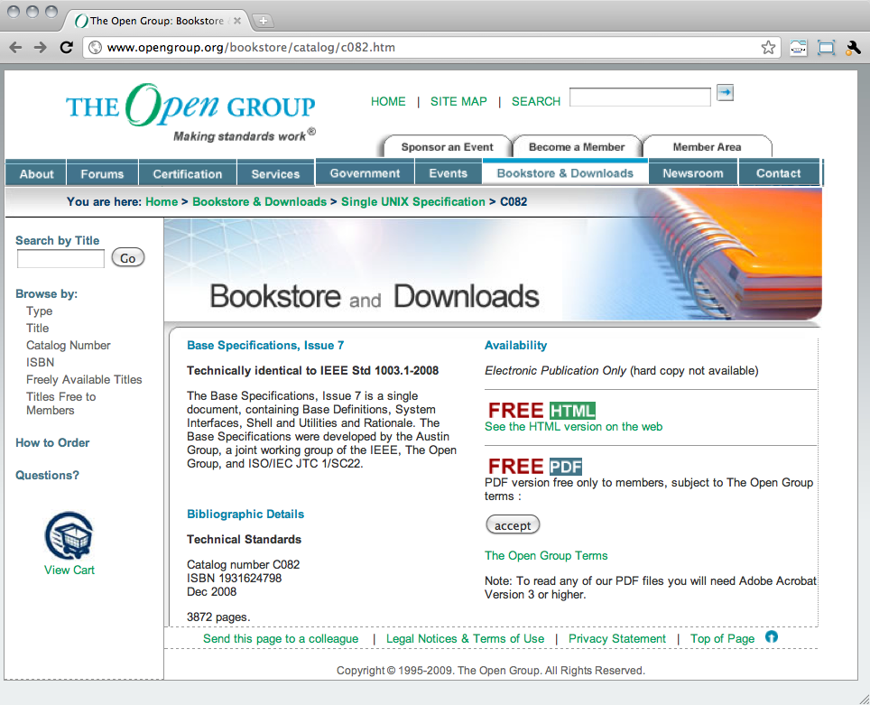
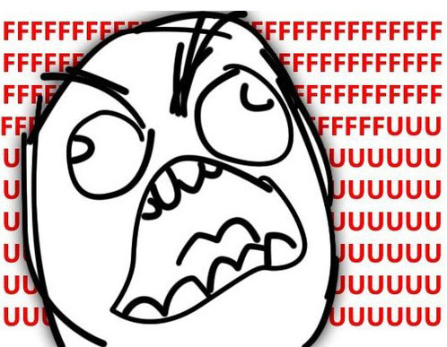

!SLIDE bigger

# `POSIX_ME_HARDER`

!SLIDE

# There are a lot of shells

!SLIDE bullets incremental

# Early Shells

* `sh` - Thompson Shell (Ken Thompson, 1971)
* `sh` - Mashey Shell (John Mashey, 1976)
* `sh` - Bourne Shell (Steve Bourne, 1977)

!SLIDE bullets incremental

# MOAR Shells

* `csh` - C Shell (Bill Joy, 1978-79)
* `ksh` - Korn Shell (David Korn, 1982)
* `ash` - Almquist Shell (Kenneth Almquist, 1989)
* `rc` - Plan 9 shell (Tom Duff, 1989)

!SLIDE bullets incremental

# Modern Shells

* `bash` - Bourne Again Shell (Brian Fox, 1987)
* `zsh` - Z shell (Paul Falstad, 1990)
* `dash` - Debian Almquist Shell (Herbert Xu, 1997)

!SLIDE commandline huge

    $ man bash | wc -w
    40868

    $ man dash | wc -w
    10102

!SLIDE code

    BUGS
      It's too big and too slow.

      There are some subtle differences
      between bash and traditional versions
      of sh, mostly because of the POSIX
      specification.

      Aliases are confusing in some uses.

      Shell builtin commands and functions
      are not stoppable/restartable.

      ...

!SLIDE smbullets incremental

# POSIX Shell

* 
* 

!SLIDE

# Where?

!SLIDE center full-page

!SLIDE center full-page

!SLIDE center

!SLIDE

## <http://opengroup.org/onlinepubs/9699919799/>

!SLIDE bullets

# Hater's Shortcut

## <http://shellhaters.heroku.com/posix>

!SLIDE image center shortcut-image

## <http://shellhaters.heroku.com/posix>

