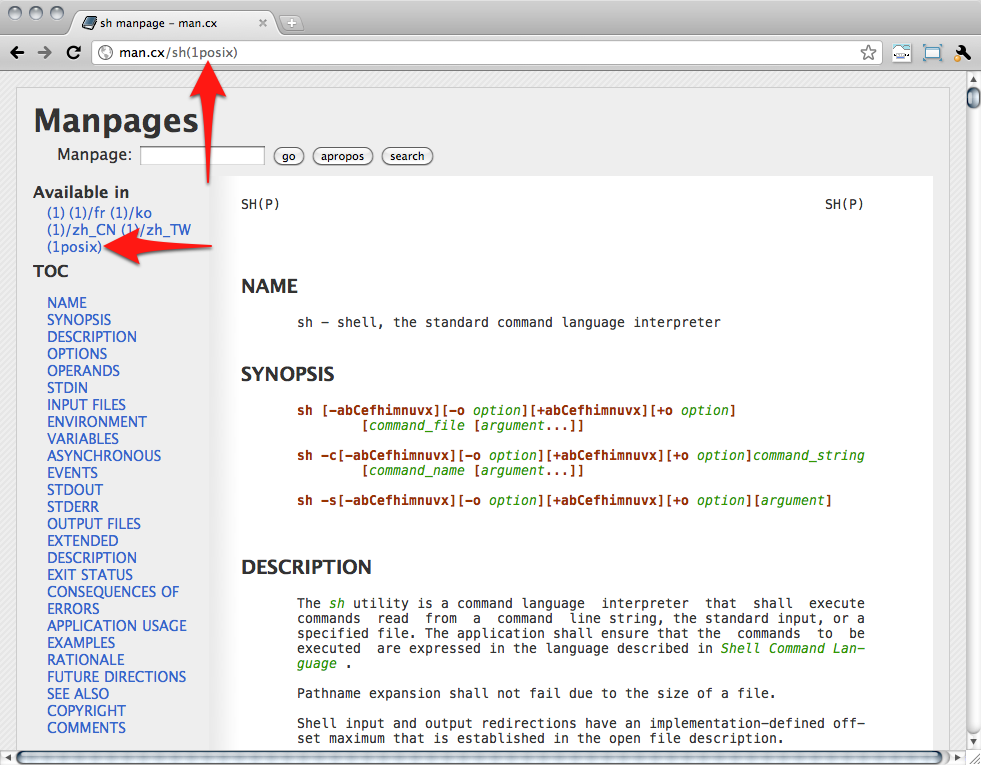

!SLIDE bullets slide-about

# [Ryan Tomayko](http://tomayko.com/about)

* [twitter.com/rtomayko](http://twitter.com/rtomayko)
* [github.com/rtomayko](http://github.com/rtomayko)

!SLIDE center

!SLIDE

# Template Script

!SLIDE code small

    @@@sh
    #!/bin/sh
    #/ Usage: your-great-program [-o <optional>] <mandatory>
    #/ A single-sentence description of your great program.
    set -e

    # show program usage
    if [ $# -eq 0 -o "$1" = "--help" ]
    then
        grep '^#/' <"$0" |
        cut -c4-
        exit 2
    fi

    # your great code

!SLIDE

# Use `&&` and `||` instead of `if`

!SLIDE code

    @@@sh
    # instead of:
    if [ $# -eq 0 -o "$1" = "--help" ]
    then
        grep '^#/' <"$0" |
        cut -c4-
        exit 2
    fi

    # try this:
    test $# -eq 0 -o "$1" = "--help" && {
        grep '^#/' <"$0" |
        cut -c4-
        exit 2
    }

!SLIDE

# <http://man.cx/>

## (use `1posix` section manual pages)

!SLIDE center full-page

!SLIDE bullets

# Debian

* <code style='font-size:48px'>apt-get install manpages-posix</code>
* *(non-free apt repository only)*
